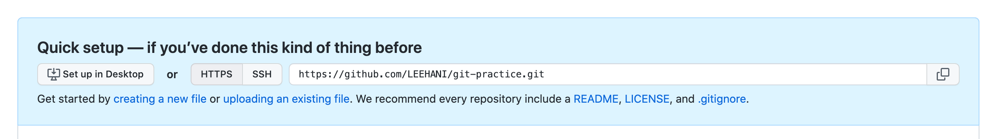

# 계정 설정 
## 글로벌 계정 설정 
```
git config --global user.name "your-name"
git config --global user.email "your@email.com"
```

## 저장소별 계정 설정 
```
git config --local user.name "your-name"
git config --local user.email "your@email.com"
```

# remote 
## git remote add [remote-name] [remote-repository-address]
- 로컬 저장소와 원격 저장소 연동 명령어 `
- 
- `git remote add origin https://github.com/LEEHANI/git-practice.git`
- 보통은 나의 repository를 origin으로 놓고 사용함. 
- `git remote` or `git remote -v`로 연결 상태 확인 가능

# clone
## git clone [remote-repository-address] 
- `git clone [remote-repository-address]`
- `git clone https://github.com/LEEHANI/git-practice.git`
- 원격 저장소의 데이터를 로컬 저장소로 복제해오며, origin으로 remote도 add 해준다. 

# checkout
## git checkout [branch] 
- 브랜치 전환 명령어 
- `git checkout [branch]`
- `git checkout -b develop`. 브랜치 생성과 체크아웃을 동시에 

# push 
- git push [remote-name] [branch]
- `git push origin master`
- 강제로 덮어써야할 경우 `git push --force origin master`