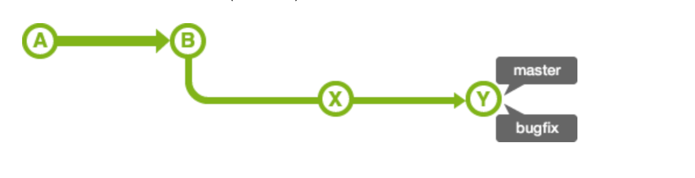

# 계정 설정 
## 글로벌 계정 설정 
```
git config --global user.name "your-name"
git config --global user.email "your@email.com"
```

## 저장소별 계정 설정 
```
git config --local user.name "your-name"
git config --local user.email "your@email.com"
```

# remote 
### git remote add [remote-name] [remote-repository-address]
- 로컬 저장소와 원격 저장소 연동 명령어
- 
- `git remote add origin https://github.com/LEEHANI/git-practice.git`
- 보통은 나의 repository를 origin으로 놓고 사용함. 
- `git remote` or `git remote -v`로 연결 상태 확인 가능

### git remote remove [remote-name]
- 원격 저장소 삭제


# clone
### git clone [remote-repository-address] 
- `git clone [remote-repository-address]`
- `git clone https://github.com/LEEHANI/git-practice.git`
- 원격 저장소의 데이터를 로컬 저장소로 복제해오며, origin으로 remote도 add 해준다. 

# pull
### git pull [remote] [branch]
- 원격 저장소 내용 가져오기 

# push 
### git push [remote-name] [branch]
- `git push origin master`
- 강제로 덮어써야할 경우 `git push --force origin master`

# branch 
### git branch [branch-name]
- `git branch test1` 
- `git branch`. local repositroy branch 목록 및 현재 브랜치 확인 
- `git branch -r`. 원격 저장소 브랜치 확인 

# checkout
### git checkout [branch] 
- 브랜치 전환 명령어 
- `git checkout [branch]`
- `git checkout -b develop`. 브랜치 생성과 체크아웃을 동시에 

# merge
### fast-forward merge 


- 동일 내용이 포함되는 브랜치의 경우 브랜치만 이동해서 병합. merge 커밋 메시지가 생성되지 않음. (변경 이력이 남지 않음)

- `git merge branch1`

### merge commit 


- `git merge --no-ff`. fast-forward 안함 
- 변경 이력이 남으므로 추적에 용이하지만 이력이 복잡해짐 

# stash 
### git stash 
- 현재 작업을 임시로 저장 
### git stash list 
- 임시로 저장해둔 작업 목록 확인 
### git stash pop 
- 최신 작업 목록 복원 

# cherry pick 

- 다른 브랜치에 있는 커밋을 내 브랜치에 적용시킬 때 사용하는 명령어 
- git cherry-pick [commit-hash]
- `git cherry-pick 3dfca1` 


# 참고 
- https://backlog.com/git-tutorial/kr/
